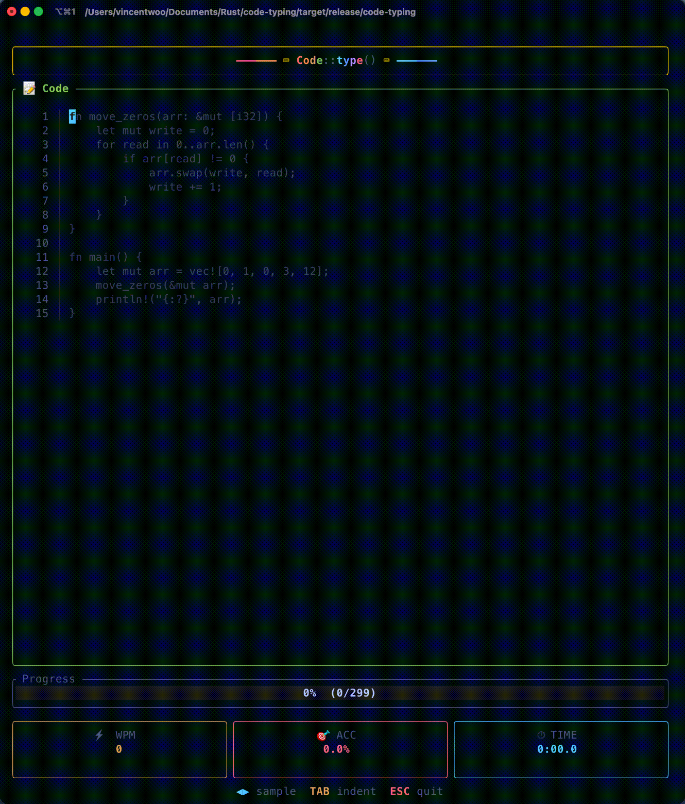

# ⌨️ Code Typing

[](https://crates.io/crates/code-typing)
[](https://opensource.org/licenses/MIT)

**A terminal-based typing game for Rust programmers.** Practice typing real Rust code snippets to build muscle memory for Rust syntax and special characters.

<p align="center">
  
</p>

## Why Code Typing?

Traditional typing tests use regular English text, but Rust programming requires typing special characters like `{}`, `=>`, `::`, `|x|`, `<T>`, and `&mut`. **Code Typing** bridges this gap:

- 🦀 **Rust-focused** — 100 curated Rust code snippets
- 🎯 **Real patterns** — algorithms, data structures, traits, iterators, and more
- ⚡ **Real-time feedback** — see correct/incorrect characters instantly
- 📊 **WPM & accuracy tracking** — measure your improvement over time

## Installation

### From crates.io

```bash
cargo install code-typing
```

### From source

```bash
git clone https://github.com/wooyukit/code-typing
cd code-typing
cargo install --path .
```

## Usage

```bash
code-typing
```

That's it! Start typing the code you see on screen. The timer starts on your first keystroke.

## Gameplay

| Visual | Meaning |
|--------|---------|
| 🟢 Green text | Correctly typed |
| 🔴 Red text | Incorrect |
| 🟡 Yellow cursor | Current position |

The progress bar shows completion. When finished, press **Enter** for a new snippet or **Esc** to quit.

## Controls

| Key | Action |
|-----|--------|
| `Tab` | Insert 4-space indentation |
| `Backspace` | Delete last character |
| `Enter` | Next snippet (after completing) |
| `Esc` | Quit |

## Code Samples Include

- **Algorithms** — QuickSort, Binary Search, Merge Sort, DFS, BFS, Dijkstra
- **Data Structures** — Linked List, Binary Tree, Stack, Queue, HashMap, BTreeMap, VecDeque
- **Classic Problems** — FizzBuzz, Two Sum, Valid Parentheses, Fibonacci
- **Rust Patterns** — Iterators, Closures, Traits, Generics, Error Handling
- **Smart Pointers** — Box, Rc, RefCell, Arc, Cow, PhantomData
- **Traits** — From/Into, Drop, Deref, AsRef, Default, Display, PartialEq/Ord, Hash, Index
- **Concurrency** — Mutex, RwLock, Channels, Threads, Arc
- **Design Patterns** — Builder, Newtype, Type State
- **Advanced Iterators** — fold, reduce, partition, peekable, flatten, flat_map

## Requirements

- Rust 1.70+ (for installation)
- Terminal with Unicode support
- Works on macOS, Linux, and Windows

## Tips for Improving

1. **Focus on accuracy first** — Speed comes naturally with muscle memory
2. **Pay attention to special characters** — `{}`, `()`, `<>`, `::`, `=>` are common in code
3. **Practice indentation** — Use Tab for consistent spacing
4. **Take breaks** — Short, focused sessions are more effective

## Contributing

Contributions welcome! Feel free to:
- Add more code samples
- Support other programming languages
- Improve the UI/UX
- Report bugs

## License

MIT © Vincent Woo
