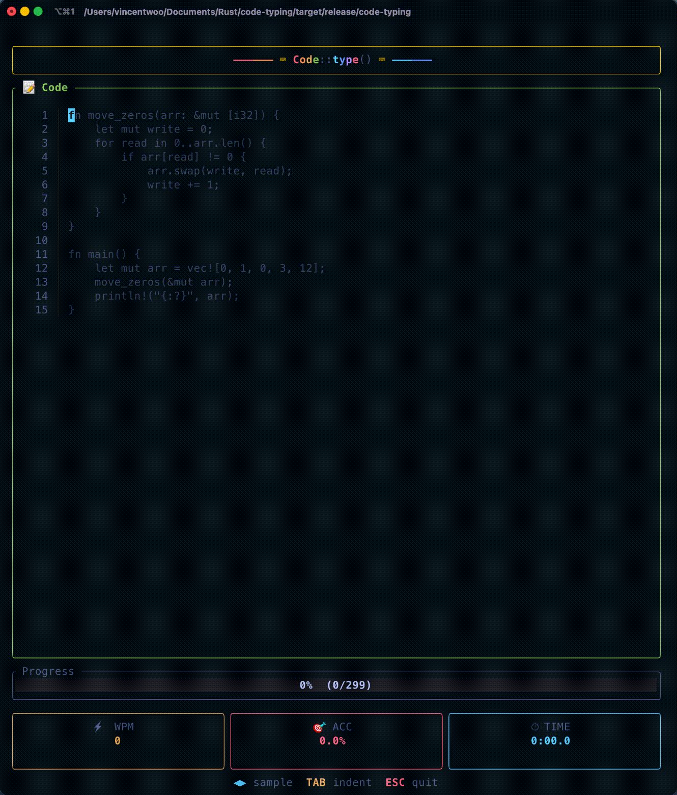
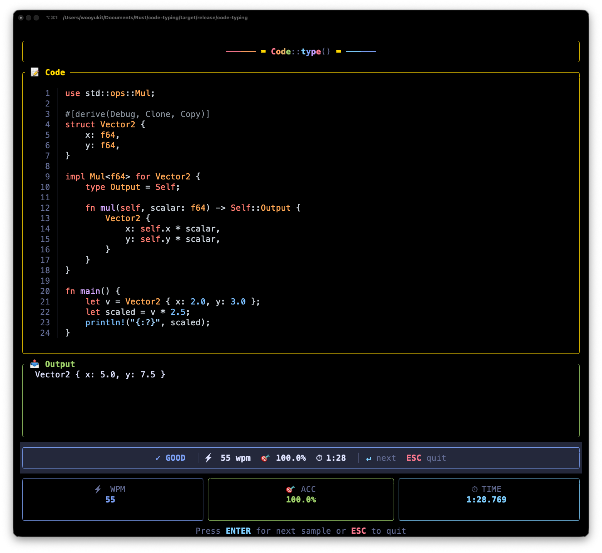

# ⌨️ Code Typing

[](https://crates.io/crates/code-typing)
[](https://opensource.org/licenses/MIT)

**A terminal-based typing game for programmers.** Practice typing real code snippets across 10 languages to build muscle memory for the syntax and special characters you actually type.

<p align="center">
  
</p>

<p align="center">
  
</p>

## 🤔 Why Code Typing?

Traditional typing tests use plain English, but code is full of characters you rarely drill — `{}`, `=>`, `::`, `|x|`, `<T>`, `&mut`, and more. **Code Typing** bridges that gap across 10 languages:

- 🌐 **10 languages** — 🦀 Rust · 🐍 Python · 🟨 JavaScript · 🟦 TypeScript · 🐹 Go · ☕ Java · 🟪 Kotlin · 🐦 Swift · 🔧 C · ➕ C++
- 🎯 **Real patterns** — algorithms, data structures, idioms, and more
- ⚡ **Real-time feedback** — see correct/incorrect characters instantly, with per-language syntax highlighting
- 📊 **WPM & accuracy tracking** — measure your improvement over time
- 📤 **Output preview** — see the expected output after finishing a snippet (where available)

## 🚀 Installation

### From crates.io

```bash
cargo install code-typing
```

### From source

```bash
git clone https://github.com/wooyukit/code-typing
cd code-typing
cargo install --path .
```

## 🎬 Usage

```bash
code-typing
```

That's it! Pick a language from the menu, then start typing the code you see on screen. The timer starts on your first keystroke. ⏱️

## 🎮 Gameplay

| Visual | Meaning |
|--------|---------|
| 🎨 Syntax-highlighted text | Correctly typed characters |
| 🔴 Red underlined text | Incorrect characters |
| 🟡 Yellow cursor | Current position |
| 📊 Progress bar | Shows completion percentage |

When you complete a snippet:

- 📤 **Output panel** appears showing the expected `println!` output (if any)
- 🎖️ **Performance rating** based on WPM and accuracy: 🏆 LEGENDARY, ⭐ EXCELLENT, ✓ GOOD, or → COMPLETE
- ⏎ Press **Enter** for a new snippet or **Esc** to quit

## ⌨️ Controls

| Key | Action |
|-----|--------|
| `↑` `↓` | 🌐 Open the language menu (before typing or after completing) |
| `←` `→` | 🔀 Change code sample (before typing starts) |
| `Tab` | ➡️ Insert indentation (language-specific width) |
| `Enter` | ↩️ Auto-indent newline (during typing) / Next snippet (after completing) |
| `Backspace` | ⬅️ Delete last character |
| `Esc` | 🔄 Restart current sample (during typing) / 🚪 Quit (before typing or after completing) |

## 📚 Languages & Samples

Choose a language from the start menu. Each ships curated snippets — **Rust** has ~100; the others (**Python, JavaScript, TypeScript, Go, Java, Kotlin, Swift, C, C++**) ship a focused starter set that's easy to extend.

The Rust set covers:

- **Algorithms** — QuickSort, Binary Search, Merge Sort, DFS, BFS, Dijkstra
- **Data Structures** — Linked List, Binary Tree, Stack, Queue, HashMap, BTreeMap, VecDeque
- **Classic Problems** — FizzBuzz, Two Sum, Valid Parentheses, Fibonacci
- **Rust Patterns** — Iterators, Closures, Traits, Generics, Error Handling
- **Smart Pointers** — Box, Rc, RefCell, Arc, Cow, PhantomData
- **Traits** — From/Into, Drop, Deref, AsRef, Default, Display, PartialEq/Ord, Hash, Index
- **Concurrency** — Mutex, RwLock, Channels, Threads, Arc
- **Design Patterns** — Builder, Newtype, Type State
- **Advanced Iterators** — fold, reduce, partition, peekable, flatten, flat_map

## 📋 Requirements

- Rust 1.70+ (for installation)
- Terminal with Unicode support
- Works on macOS, Linux, and Windows

## 💡 Tips for Improving

1. 🎯 **Focus on accuracy first** — Speed comes naturally with muscle memory
2. ⚡ **Pay attention to special characters** — `{}`, `()`, `<>`, `::`, `=>` are common in code
3. 📐 **Practice indentation** — Use Tab for consistent spacing
4. ☕ **Take breaks** — Short, focused sessions are more effective

## 🤝 Contributing

Contributions welcome! Feel free to:
- Add more code samples
- Support other programming languages
- Improve the UI/UX
- Report bugs

## 📄 License

MIT © Vincent Woo
